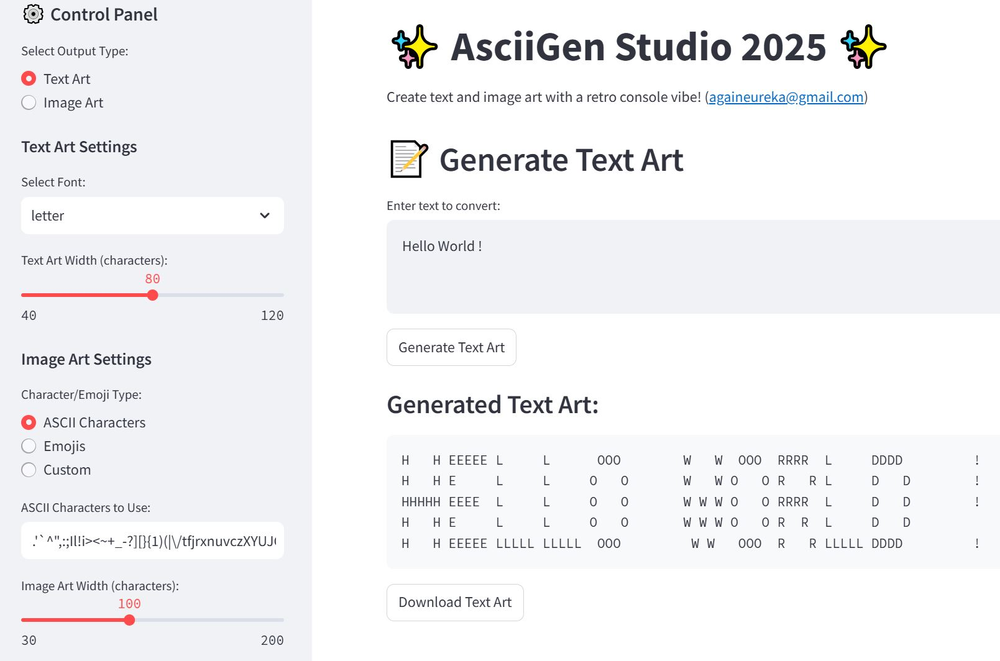
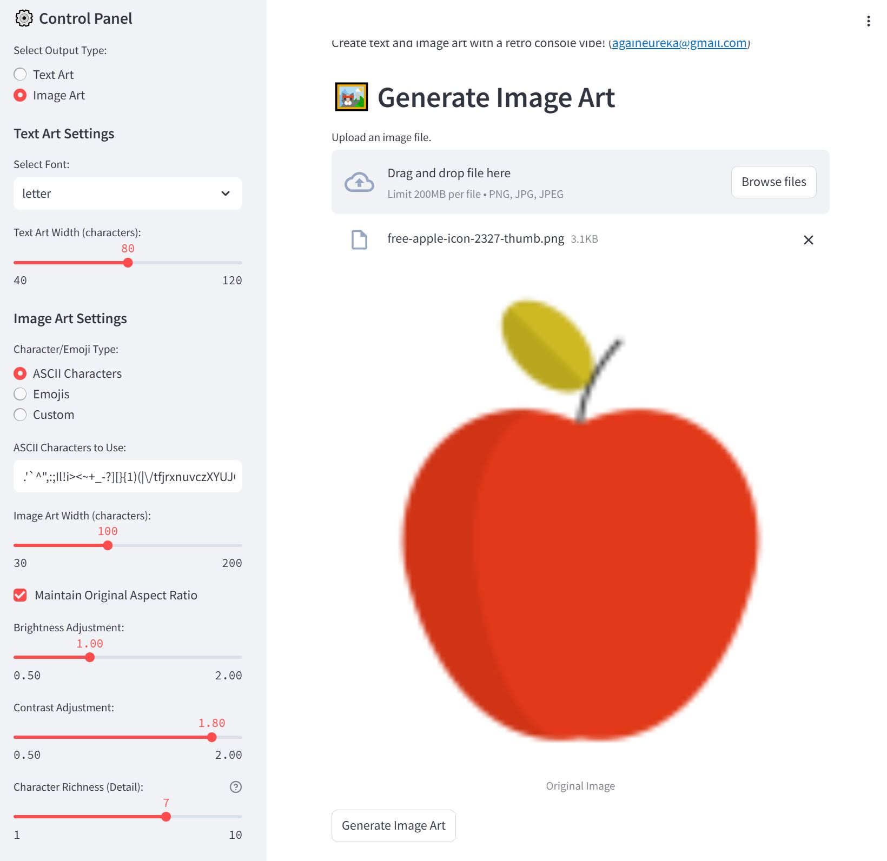
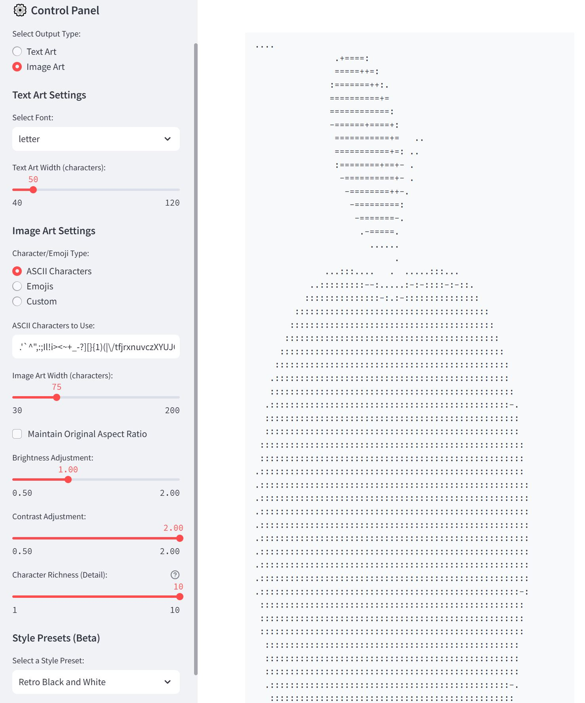

# ascii_gen_studio

- Ascii Gen Studio 2025
- JPark (againeureka@gmail.com), Sep. 2025
- https://github.com/againeureka/ascii_gen_studio.git


## Demo pages








## Project Overview: AsciiGen Studio 2025

This is a web application built with **Streamlit** and **Python** that allows users to create text-based art from either text input or an uploaded image. 
It's a modern take on the classic command-line ASCII art generators.

-----

## Core Features

  * **Text Art Generation**: Convert any text into stylized ASCII art using various fonts.
  * **Image Art Generation**: Transform an image into a stunning piece of ASCII or Emoji art based on pixel brightness.
  * **Customization**: Fine-tune the output with a variety of controls, including:
      * **Output Type**: Switch between generating text art and image art.
      * **Font Selection**: Choose from a wide range of `pyfiglet` fonts for text art.
      * **Character Set**: Customize the characters or emojis used for image conversion.
      * **Output Dimensions**: Adjust the width and aspect ratio of the generated art.
      * **Image Adjustments**: Control brightness and contrast to optimize the final look.
      * **Character Richness**: Control the level of detail by limiting or expanding the character set used.
      * **Style Presets**: Apply pre-configured settings for different artistic styles (e.g., "Retro Black and White").

-----

## How to Use

### 1\. Installation

First, you need to install the required Python libraries. Open your terminal or command prompt and run:

```bash
pip install streamlit pillow pyfiglet numpy
```

### 2\. Running the Application

Save the provided Python code as a file (e.g., `app.py`). Then, navigate to the directory where you saved the file and execute the following command:

```bash
streamlit run app.py
```

This will launch the web application in your default web browser.

### 3\. Using the Interface

The interface is simple and intuitive:

1.  **Select an option** from the "Select Output Type" radio buttons on the left sidebar.
2.  If **Text Art** is selected, enter your text in the text area and choose a font and width from the sidebar.
3.  If **Image Art** is selected, upload an image file and adjust the various sliders and controls in the sidebar to achieve your desired effect.
4.  Click the **"Generate"** button to see the result in the main window.
5.  Use the **"Download"** button to save your generated art as a text file.

